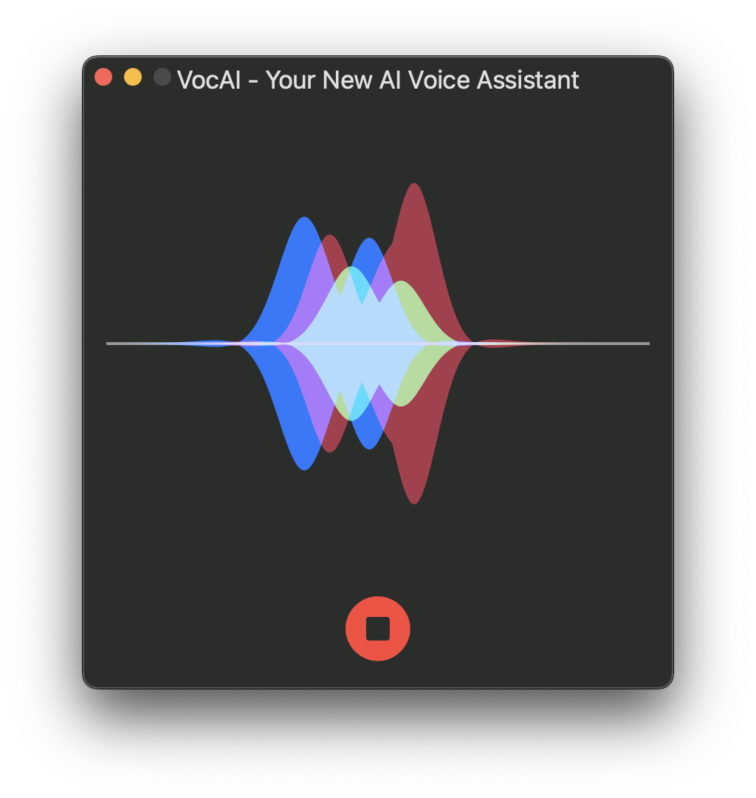

# VocAI

## Overview
VocAI is an advanced AI voice assistant that leverages the latest technologies from OpenAI. Built with Swift UI, this app is designed to provide seamless support across iOS, macOS, and visionOS using a single codebase. VocAI transforms the way you interact with your devices by converting your speech into text and then responding with natural-sounding speech.

## Key Features

### Cutting-Edge AI Integration
- **OpenAI GPT-4**: The latest Large Language Model (LLM) from OpenAI powers VocAI, ensuring sophisticated and context-aware responses.
- **Whisper API**: Converts audio speech to text with remarkable accuracy, making sure your voice commands are understood perfectly.
- **New TTS API**: Converts text back to speech, providing clear and natural-sounding responses.

### Cross-Platform Support
- **Swift UI**: Built using Swift UI, VocAI runs smoothly on iOS, macOS, and visionOS. Enjoy a consistent and unified experience across all Apple devices.

## Requirements

- Xcode 15
- iOS 17
- macOS 14
- visionOS 1.0
- [OpenAI API Key] (platform.openai.com) 
- Add your API key in the ViewModel.swift file and build it again.
- Add the Siri Wave Form package from [https://github.com/muskan09/SiriWaveView]. This package exposes the view as an SPM Library, making it easily integratable into modern SwiftUI projects.
- Add the Open AI client package from [https://github.com/muskan09/VocaAIOpenAIClient]. This pacakage provides Authentication Middleware to inject API Key to Authorization Header.

## License

VocAI is available under the MIT license. See the LICENSE file for more information.
